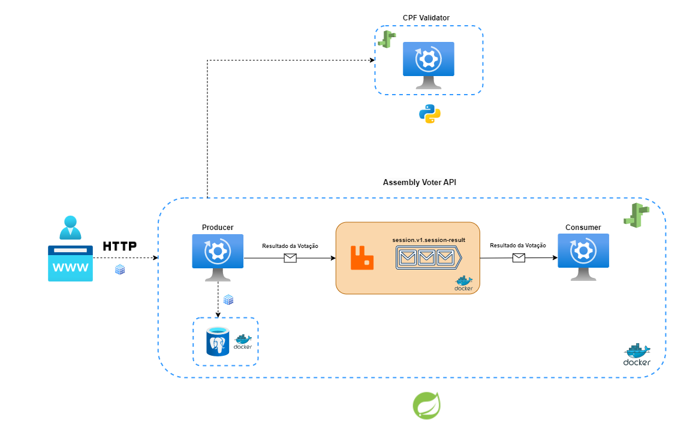

Backend Desenvolvido em **Spring Boot** juntamento com **Postgres**, **RabbitMQ** e deploy no **AWS Elastic Beanstalk**

### Algumas informações

- A aplicação CPF VALIDATOR está hospedada na AWS Elastic BeanStalk e não no Heroku [ PAGO ]:
  - link URL BASE:
  ```sh
      $ http://cpfvalidator-env.eba-vutbp3fp.us-east-2.elasticbeanstalk.com
  ```

#### Problema base:
No cooperativismo, cada associado possui um voto e as decisões são tomadas em assembleias, por votação.
A partir disso, você precisa criar uma solução back-end para gerenciar essas sessões de votação.

Essa solução deve ser executada na nuvem e promover as seguintes funcionalidades através de uma API
REST:
- Cadastrar uma nova pauta;
- Abrir uma sessão de votação em uma pauta (a sessão de votação deve ficar aberta por um tempo
determinado na chamada de abertura ou 1 minuto por default);
- Receber votos dos associados em pautas (os votos são apenas 'Sim'/'Não'. Cada associado é
identificado por um id único e pode votar apenas uma vez por pauta);
- Contabilizar os votos e dar o resultado da votação na pauta.
- Integração com sistemas externos que verifique, a partir do CPF do associado, se ele pode votar
-O resultado da votação precisa ser informado para o restante da plataforma, isso deve ser
  feito preferencialmente através de mensageria. Quando a sessão de votação fechar, poste
  uma mensagem com o resultado da votação.
---

### Explicando Arquitetura Construída:



- A arquitetura foi baseada em microserviços, onde faço o uso de containers docker e também instancias AWS Elastic Beanstalk, para gerir minhas aplicações


| Tecnologias           | Motivo do uso                                                                                                                                                                                                  | 
|-----------------------|----------------------------------------------------------------------------------------------------------------------------------------------------------------------------------------------------------------|
| *Spring Boot*         | Sou suspeito pra falar, mas sou amante de Java :)                                                                                                                                                              |
| *Postgres*            | Banco de dados Relacional. Prefiri utilizar um banco de dados relacional por existir muitos relacionamentos entre as entidades.                                                                                |                                                                                                                                                        |
| *RabbitMQ*            | Por se tratava de uma aplicação baseada em Microserviços. O serviço de mensageria vem a calhar por se tratar de um cenário com poucas quantidades de requisições e informar unicamente do resultado da votação. |
| *Docker*              | Estruturação em cache multistaged Gradle e OpenJDK.                                                                                                                                                            |
| *CPF Validator*       | Api Externa desenvolvida em Pythobn e hospedada na cloud AWS.                                                                                                                                                  |
| AWS Elastic Beanstalk | Cloud utilizada para hospedar as aplicações, gerenciamento rápido, monitorando e garantir balaceamento de carga                                                                                                |
- Nessa arquitetura, o objeto é fazer com que possa ser mostrado duas coisa:
  - Requisição para uma API externa hospedada em cloud utilizando Spring WebFlux;
  - Controle de Mensageria enviando messagem para o consumidor e 
  - salvar o resultado da votação.
- Nesse ponto, o *Redis* entra em ação e faz com que esse dado retornado do microserviço seja armazenado em cache.

---
### Organização do código:
- A arquitetura foi baseada em microserviços, onde faço o uso de containers docker e Elastic Beanstalk para gerir minhas aplicações;
- O projeto possui *Produtor* e *Consumidor*;
- Foi seguido estrutura MVC;
- Multistage do docker é feito em cima do modulo principal;
- Módulo tem seu `Dockerfile` e é utilizando no `docker-compose` raiz;
- Para o reuso e transição de objetos DTO, separei em Objetos de Request e Response.

### Estrutura de commits e Versionamento:
A ideia inicial do meu Git Flow é seguir uma granularização simples e efetiva
- classe principal: *main*
- a partir dela: *develop*
- A partir da *develop*:
    - Entidades
    - Docker
    - RabbitMQ

desenvolvido cada módulo da aplicação e quando finalizada, *merjada* para a develop.

### Pontos de melhoras:
- Exceções mais rebuscadas do AMQP. Quando o processamento de uma fila é derrubada, pode ser que aconteça reprocessamento da fila sem interrupcções
- Implementar um segunda fila para o microserviço que gerencia os CPF e criação de Exchange
- Reduzir - ainda mais - o tamanho das imagens geradas das aplicações no docker
- Aumenta a cobertura de teste automatizados.
- Inserir o gerenciamento com Sonar
- Aumentar o controle da Thread quando abrir uma sessão
---
### Instalação

*Requisitos:*

- [Docker](https://docs.docker.com/get-docker/)

### Rodar Aplicação:

```sh
$ docker compose up
```

#### Porta:

```sh
$ 8080
```

#### URL Base:

```sh
$ http://localhost:8080/api/v1/assembly-voter
```
---
### Documentação da API

- [Swagger](https://swagger.io)
```sh
$ http://localhost:8080/api/v1/assembly-voter/swagger-ui/index.html
```

---

### Requisições Postman
- [Endpoints - Postman](https://github.com/lucaswilker14/assembly-voter/tree/develop/postman-endpoints)